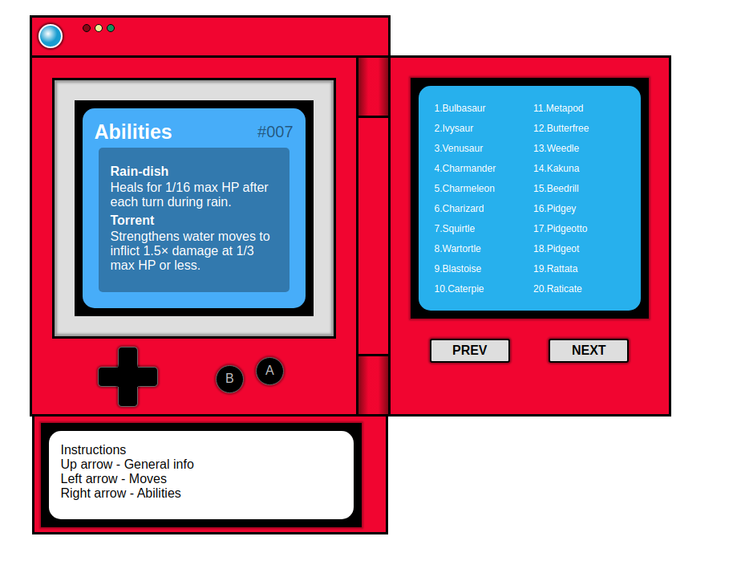

# pokedex
A vanilla JS pokedex. For educational purposes

I followed Justin Kims tutorial on youtube:

https://www.youtube.com/watch?v=wXjSaZb67n8

Here is an image from Justin Kim's original:

## Personal additions
I added some of my own functionality for educational purposes. I fetch info on ability and moves for every Pokemon from the API. 
This info is available by using the d-pad on the Pokedex.

## Acknowledgments

* Hat tip to to Justin Kim for creating the tutorial
